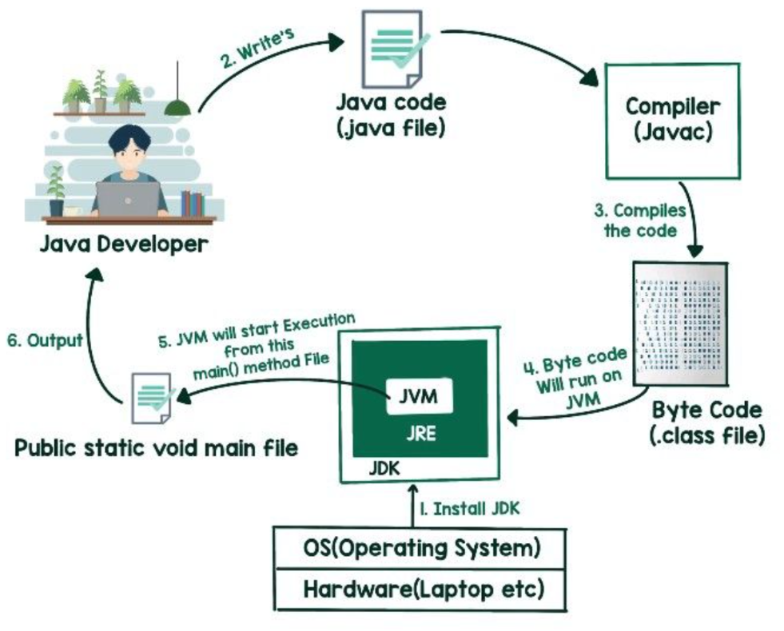

# JAVA



## Varaibles

```java
String user_name = "KARTHIK"
```

Here String is the type of the variable.  
**user_name** is the name of the variable.  
**KARTHIK** is the data in the variable.

They are of 2 types:-  
Primitive  
Non-Primitive

### Primitive

byte :- numbers between -128 to 127  
char  
int  
float  
char

### Non-Primitive

Strings is the best example of Non-Primitive datatype.  
Non-Primitive has built in methods for operations variables.

## RULES OF DECLARING VARIABLES

During decleration of float number we must end the value with "F" so that the compilers identifies it as an float number rather than an integer number. Same for long we must use "L" at the end of the number.

# Strings

## OPERATIONS ON STRINGS

Print the length of the variable.

```java
String name = "Karthik";
System.out.println(name.length());
```

Concatenate two strings

```java
String name_1 = "Karthik";
String name_2 = "Athota";
String name_3= name_1+name_2;
System.out.println(name_3);
```

char.AT() => reuturn the value at the argument passed.

```java
String name_1 = "Karthik";
System.out.println(name_1.charAt(0));
```
